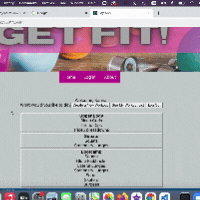

Get Fit!
  

Description
A workout generator that can serve various purposes to help users create workouts
and find out more about exercises that match their preferences. This is a working
database that can be added to ongoingly with new exercises submitted by users. This is a React app that contains a JSON file of data. 

Usage
- A user should see a navigation bar upon opening the app in the browser, with Home, 
Login and About tabs. These tabs should each be clickable and should change color when 
being hovered over. 
- The home tab should keep the user on the homepage, and bring them back to the homepage 
if clicked elsewhere within the app. 
- The login tab should populate two input forms; a "create new user" form and a "login" form.
Users should be able to login with their existing username if they've already created one. If 
they are new users, they should be able to enter a new username and have it posted to the database. If an erroneous username, or one that is already taken, is entered, error messages should pop up on screen to alert the user. 
- The user, if logged in successfully, should see a welcome message with their name, along with 
options to either create a new workout or view their saved workouts. 
- The "create a new workout" button should pull up two select forms with drop downs offering 
exercise categories and difficulty levels. When the forms are completed and the submit button is clicked, all exercises from the database that match the input should appear on screen as buttons. If the "sort by likes" checkbox is checked, the list should show the exercises in order of most to fewest "likes." The user should be able to click each exercise to have it add to their workout list below.
- The workout list should show added exercises with x buttons next to them that delete them from the list when clicked. After at least one exercise is added to the list, a "save workout" form should appear with input for a name and a submit button. Clicking the button should post the exercise to that user's workouts array, which contains each saved workout as an object. 
- Another element that should appear when the "create new workout" button is clicked is an "add an exercise" form. A user should be able to submit a new exercise by filling in the name, category and difficulty level, and then that exercise gets posted to the database. 
- If a user clicks the "see my workouts" button instead of the "create new workout" button, it shoudl populate lists of their stored workouts on screen. Each exercise in the lists should be clickable, and a "card" should come up showing the exercise name, difficulty, category and number of likes. The card should disappear if the user clicks the close button. 
- If any forms are submitted incomplete, an error message should pop up on screen alerting the user that they didn't complete the fields and to try again.

Visuals

Support
For support, please email karina.stabile@gmail.com

Roadmap

Contributing
I am open to contributions, please email me to inquire. Any editors must have React and JSON enabled. 